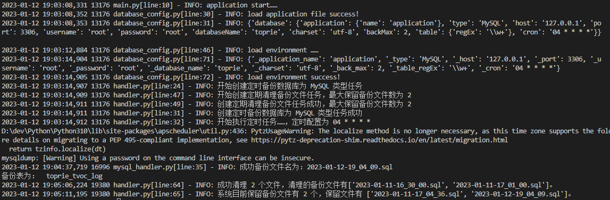

<h1 align="center">
  <br>
  <a href="https://github.com/hechunhuis/" alt="logo" ></a>
  <br>
  数据库备份系统
  <br>
</h1>

<h4 align="center">基于Python3开发的轻量级数据库全量备份系统</h4>


<h1 align="center">
  
</h1>

## ✨ 特性
- 支持的数据库列表
  - MySQL
  - Oracle (待开发)
  - SQLServer (待开发)
  - PostgreSQL (待开发)
  - SQLite (待开发)
  - Hive (待开发)
- 支持自定义cron备份规则
- 支持正则表达式匹配数据库表备份
- 支持自定义保存备份文件最大数量
- 支持将备份文件发送到远程备份主机 (待开发)
- 支持发送定时备份通知 (待开发)
## ⚙️ 配置
运行前需配置application.yml文件，信息如下：<br />
注意：环境变量配置高于application.yml文件配置！
```yaml
application:            # 应用程序模块
  name: application     # 需要备份数据库所属的应用名称

database:               # 数据库配置项
  type: MySQL           # 需要备份的数据库类型：MySQL Oracle SQLServer PostgreSQL SQLite Hive
  host: 127.0.0.1       # 数据库的地址
  port: 3306            # 数据库端口
  username: root        # 数据库用户名
  password: root        # 数据库密码
  databaseName: dbname  # 需要备份的数据库名称
  charset: utf-8
  backMax: 20           # 备份保留的最大文件数
  table:
    regEx: \w+          # 备份符合正则表达式的表名
  cron: 53 * * * *      # 备份的时间表达式(五位数)

remote:                 # 远程模块（主要将备份文件发送到远程主机）
  host:                 # 远程备份主机地址，例如：192.168.50.50
  username:             # 远程备份主机用户名，例如：root
  password:             # 远程备份主机密码，例如：root

notify:                 # 通知模块，通知定时备份任务状态
  dingding:             # 钉钉通知
  email:                # 邮箱通知

```
## 🛠️ 运行&部署
```shell
# 前提需要宿主机安装Python3、virtualenv以及 pip
git clone https://github.com/hechunhuis/database-backup.git
cd ./database-backup
virtualenv --python=python3
source env/bin/activate
pip install -i https://pypi.doubanio.com/simple/ -r requirements.txt
python3 main.py
```

## ⛏ Docker构建
```shell
docker build . -f Dockerfile.core -t databaseback/core:lastest
```
## 🚴🏻‍♀️ Docker启动
```shell
docker run --name databaseback \
 -e application.name=applicationName \
 -e database.type=MySQL \
 -e database.host=127.0.0.1 \
 -e database.port=3306 \
 -e database.username=root \
 -e database.password=root \
 -e database.databaseName=dbName \
 -e database.backMax=20 \
 -e database.table.regEx=^\w+$ \
 -e database.cron='15 * * * *' \
 -v D:\dback:/app/dbback \
 -v D:\logs:/app/logs \
 -d databaseback/core:lastest
```
